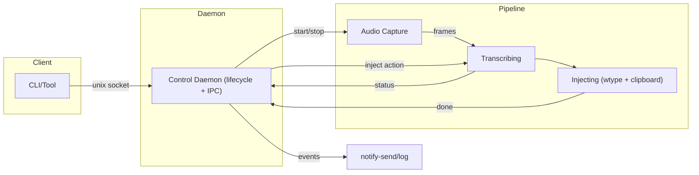
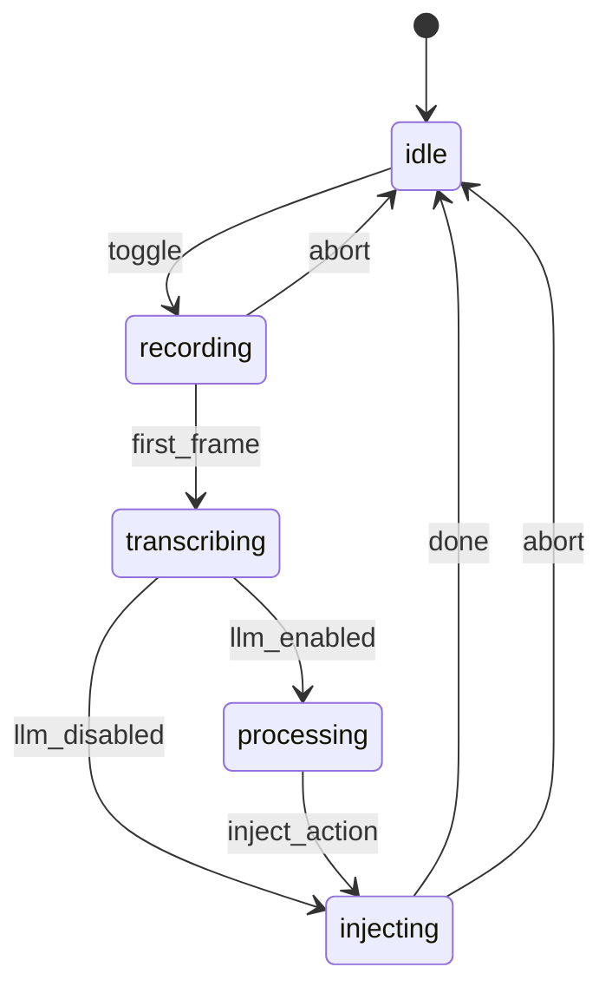

# Hyprvoice - Voice-Powered Typing for Wayland/Hyprland

26 voice models, cloud and local, built for hyprland dictation.

Press a toggle key, speak, and get instant text input. Built natively for Wayland/Hyprland with clean PipeWire capture and robust text injection.

## Highlights

- 26 speech-to-text models across cloud and local providers, including whisper.cpp.
- Streaming and batch transcription with 57-language support and model-language validation.
- Optional LLM post-processing for grammar, punctuation, and more.
- Toggle workflow with optional status notifications and cancel support.
- Text injection via ydotool, wtype, and clipboard fallback with clipboard restore.
- Guided onboarding and a full configure menu with hot-reload.
- Personalization through custom prompt and keywords sent both to LLM and to voice model.
- Whisprflow quality but for linux and open source.

## Voice Providers and Models

All supported speech-to-text providers and models:

### OpenAI (cloud)

- `whisper-1` (batch)
- `gpt-4o-transcribe` (batch)
- `gpt-4o-mini-transcribe` (batch)
- `gpt-4o-realtime-preview` (streaming)

### Groq (cloud)

- `whisper-large-v3`
- `whisper-large-v3-turbo`

### Mistral (cloud)

- `voxtral-mini-latest`

### ElevenLabs (cloud)

- `scribe_v1` (batch)
- `scribe_v2` (batch)
- `scribe_v2_realtime` (streaming)

### whisper-cpp (local)

- English-only: `tiny.en`, `base.en`, `small.en`, `medium.en`
- Multilingual: `tiny`, `base`, `small`, `medium`, `large-v1`, `large-v2`, `large-v3`, `large-v3-turbo`

### Deepgram (cloud)

- `flux-general-en`
- `nova-3`
- `nova-2`

## Installation (AUR)

```bash
yay -S hyprvoice-bin
# or
paru -S hyprvoice-bin
```

The package installs system dependencies and the systemd user service.
You'll still need an API key for a cloud provider, or whisper.cpp for local transcription. Onboarding will guide you through the choice.

## Quick Start

1. Run onboarding:

```bash
hyprvoice onboarding
```

2. Enable and start the service:

```bash
systemctl --user enable --now hyprvoice.service
```

3. Add a keybinding (Hyprland example):

```bash
bind = SUPER, R, exec, hyprvoice toggle
```

4. Test voice input:

```bash
hyprvoice toggle
```

Run `hyprvoice configure` anytime for advanced settings.

## Commands

### Core CLI

```bash
hyprvoice onboarding
hyprvoice configure
hyprvoice serve
hyprvoice toggle
hyprvoice cancel
hyprvoice status
hyprvoice version
hyprvoice stop
```

### Model management (whisper-cpp)

```bash
hyprvoice model list
hyprvoice model list --provider whisper-cpp
hyprvoice model download base.en
hyprvoice model remove base.en
```

### Model testing (E2E)

```bash
hyprvoice test-models
hyprvoice test-models --audio /path/to/sample.wav --output test-models.json
```

### Service management

```bash
systemctl --user status hyprvoice.service
systemctl --user restart hyprvoice.service
journalctl --user -u hyprvoice.service -f
```

## Configuration

Configuration lives in `~/.config/hyprvoice/config.toml` and hot-reloads automatically.

- First-time setup: `hyprvoice onboarding`
- Full TUI editor: `hyprvoice configure`

## Docs

- `docs/config.md` - configuration reference and examples
- `docs/providers.md` - provider and model details
- `docs/architecture.md` - architecture and adapter overview
- `docs/structure.md` - code map and entry points
- `docs/testing.md` - integration testing with test-models

## Troubleshooting

### Common Issues

#### Daemon Issues

**Daemon won't start:**

```bash
# Check if already running
hyprvoice status

# Check for stale files
ls -la ~/.cache/hyprvoice/

# Clean up and restart
rm -f ~/.cache/hyprvoice/hyprvoice.pid
rm -f ~/.cache/hyprvoice/control.sock
hyprvoice serve
```

**Command not found:**

```bash
# Check installation
which hyprvoice

# Add to PATH if using ~/.local/bin
echo 'export PATH="$HOME/.local/bin:$PATH"' >> ~/.bashrc
source ~/.bashrc
```

#### Audio Issues

**No audio recording:**

```bash
# Check PipeWire is running
systemctl --user status pipewire

# Test microphone
pw-record --help
pw-record test.wav

# Check microphone permissions and levels
```

**Audio device issues:**

```bash
# List available audio devices
pw-cli list-objects | grep -A5 -B5 Audio

# Check microphone is not muted in system settings
```

#### Notification Issues

**No desktop notifications:**

```bash
# Test notify-send directly
notify-send "Test" "This is a test notification"

# Install if missing
sudo pacman -S libnotify  # Arch
sudo apt install libnotify-bin  # Ubuntu/Debian
```

#### Text Injection Issues

**Text not appearing:**

- Ensure cursor is in a text field when toggling off recording
- Check that `wtype` and `wl-clipboard` tools are installed:

  ```bash
  # Test wtype directly
  wtype "test text"

  # Test clipboard tools
  echo "test" | wl-copy
  wl-paste
  ```

- Verify Wayland compositor supports text input protocols
- Check injection backends in configuration (fallback chain is most robust)

**Clipboard issues:**

```bash
# Install wl-clipboard if missing
sudo pacman -S wl-clipboard  # Arch
sudo apt install wl-clipboard  # Ubuntu/Debian

# Test clipboard functionality
wl-copy "test text"
wl-paste
```

### Debug Mode

```bash
# Run daemon with verbose output
hyprvoice serve

# Check logs from systemd service (or just see results from hyprvoice serve)
journalctl --user -u hyprvoice.service -f

# Test individual commands
hyprvoice toggle
hyprvoice status
```

## Architecture Overview

Hyprvoice uses a **daemon + pipeline** architecture for efficient resource management:

- **Control Daemon**: Lightweight IPC server managing lifecycle
- **Pipeline**: Stateful audio processing (recording → transcribing → processing → injecting)
- **State Machine**: `idle → recording → transcribing → processing → injecting → idle`

### System Architecture





### How It Works

1. **Toggle recording** → Pipeline starts, audio capture begins
2. **Audio streaming** → PipeWire frames buffered for transcription
3. **Toggle stop** → Recording ends, transcription starts
4. **LLM processing** → Text cleaned up (if enabled)
5. **Text injection** → Result typed or copied to clipboard
6. **Return to idle** → Pipeline cleaned up, ready for next session

### Data Flow

1. `toggle` (daemon) → create pipeline → recording
2. First frame arrives → transcribing (daemon may notify `Transcribing` later)
3. Audio frames → audio buffer (collect all audio during session)
4. Second `toggle` during transcribing → transcribe collected audio
5. If LLM enabled → processing → clean up text with LLM
6. injecting → type or paste text
7. Complete → idle; pipeline stops; daemon clears reference
8. Notifications at key transitions

## License

MIT License - see [LICENSE.md](LICENSE.md) for details.
