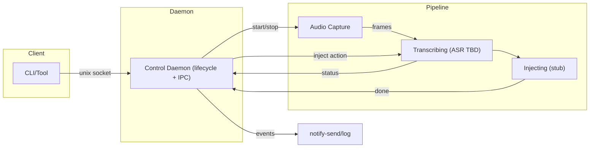
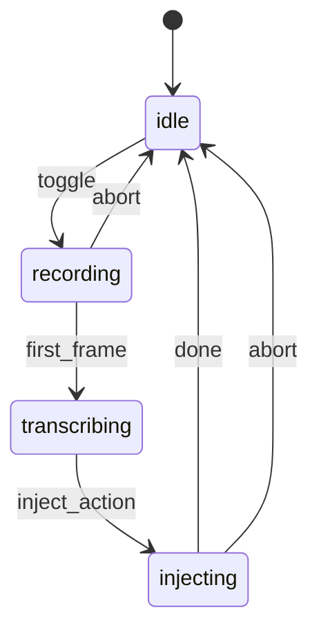

# Hyprvoice

> Voice‑powered typing for Wayland/Hyprland — press to toggle, speak, instant paste.
> Streams audio while you talk and pastes the final text the moment you toggle off → aims to be the fastest feel on Wayland.

**Status:** Early development (expect rough edges)

---

## TL;DR

- Toggle workflow (Hyprland‑friendly): press to start, press to stop.
- Pipeline owns state; daemon is a thin control plane (IPC + lifecycle).
- Notifications for key events (recording started/ended, aborted).
- Audio capture via PipeWire (`pw-record`) with backpressure.
- ASR + clipboard injection are planned; injection is currently stubbed.

---

## Requirements

- Go 1.24.5+ (for building from source)
- Wayland + Hyprland
- PipeWire tools: `pw-record` and `pw-cli`
- systemd --user (service)
- Optional: libnotify/`notify-send` (desktop notifications)
- Planned/optional: `wl-clipboard` (clipboard save/restore), `wtype`/`ydotool` (text injection)

> Other distros may work, but Arch/Hyprland is the primary target for now.

---

## Install (Arch / Hyprland)

```bash
# AUR
yay -S hyprvoice          # or: yay -S hyprvoice-bin

# Enable user service
systemctl --user enable --now hyprvoice.service

# Hyprland keybind (toggle)
bind = SUPER, R, exec, hyprvoice toggle
```

---

## Usage

### Basic Usage

- Press your toggle key to start; press again to stop.
- Audio is captured via PipeWire; the pipeline enters `transcribing` after the first frame.
- On toggle‑off during `transcribing`, an `inject` action is sent. Injection is currently simulated (no clipboard paste yet).

### CLI Commands

```bash
# Start the daemon
hyprvoice serve

# Toggle recording on/off
hyprvoice toggle

# Check current status
hyprvoice status

# Get protocol version
hyprvoice version

# Stop the daemon
hyprvoice stop
```

---

## Status

| Component              | State | Notes                                                    |
| ---------------------- | ----- | -------------------------------------------------------- |
| Daemon (control plane) | ✅    | IPC server, lifecycle; forwards status from the pipeline |
| Recording control      | ✅    | `hyprvoice toggle`                                       |
| Desktop notifications  | ✅    | `notify-send` (logs fallback)                            |
| Audio capture          | ✅    | PipeWire (`pw-record`) frames + bounded channels         |
| ASR backends           | ⏳    | Not implemented yet (cloud/local planned)                |
| Text injection         | ⏳    | Not implemented; will use clipboard + `wtype`/`ydotool`  |
| Service management     | 🔄    | `systemd --user` unit example provided                   |

Legend: ✅ done · 🔄 in progress · ⏳ planned

---

## How it works

- Model: The pipeline owns all runtime state; the daemon is a control plane (IPC + lifecycle) that starts/stops a pipeline instance and forwards status.
- State machine (pipeline): `idle → recording → transcribing → injecting → idle`.
- Rule: switch to `transcribing` as soon as the first audio frame arrives.

### Diagrams





### Data flow

1. `toggle` (daemon) → create pipeline → recording
2. First frame arrives → transcribing (daemon may notify `Transcribing` later)
3. Second `toggle` during transcribing → send `inject` action → injecting (simulated)
4. Complete → idle; pipeline stops; daemon clears reference
5. Notifications at key transitions

---

## Build from source

```bash
git clone https://github.com/leonardotrapani/hyprvoice.git
cd hyprvoice

# Build the binary
CGO_ENABLED=1 go build -o hyprvoice ./cmd/hyprvoice

# Run tests (when available)
go test ./...

# Install locally
sudo cp hyprvoice /usr/local/bin/
```

### Dependencies

- Cobra CLI - Command-line interface framework
- Go 1.24.5+ - Programming language runtime

---

## Configuration

### File Locations

- Socket: `~/.cache/hyprvoice/control.sock` - IPC communication
- PID file: `~/.cache/hyprvoice/hyprvoice.pid` - Process tracking

### Systemd Service

In the future, this will be implemented with the command `hyprvoice install`
The daemon runs as a user service. To create a systemd service file:

```bash
# Create service file at ~/.config/systemd/user/hyprvoice.service
mkdir -p ~/.config/systemd/user
cat > ~/.config/systemd/user/hyprvoice.service << 'EOF'
[Unit]
Description=Hyprvoice daemon
After=pipewire.service

[Service]
Type=simple
ExecStart=/usr/local/bin/hyprvoice serve
Restart=on-failure
RestartSec=5

[Install]
WantedBy=default.target
EOF

# Enable and start
systemctl --user daemon-reload
systemctl --user enable --now hyprvoice.service
```

---

## Development

### Project Structure

```
hyprvoice/
├── cmd/hyprvoice/         # Main CLI application
├── internal/
│   ├── bus/              # IPC (Unix socket) + PID management
│   ├── daemon/           # Control plane (IPC server, lifecycle; no state)
│   ├── notify/           # Desktop notifications
│   └── pipeline/         # Pipeline + state machine (record/transcribe/inject)
├── go.mod                # Go module definition
└── README.md
```

### State Machine

The pipeline operates with these states:

- idle → recording → transcribing → injecting → idle

### IPC Protocol

Single-character commands over Unix socket:

- `t` - Toggle recording
- `s` - Get status
- `v` - Get protocol version
- `q` - Quit daemon

### Running in Development

```bash
# Terminal 1: Start daemon with logs
go run ./cmd/hyprvoice serve

# Terminal 2: Test commands
go run ./cmd/hyprvoice toggle
go run ./cmd/hyprvoice status
```

---

## Direction / Roadmap

- ASR integration: start with a cloud streaming backend; add a local backend later.
- Proper injection: clipboard save/restore + Ctrl+V, with `wtype`/`ydotool` fallbacks.
- VAD / endpointing to auto‑stop on silence (in addition to manual toggle).
- Configuration for devices, sample rate, and buffer sizing.
- Tests for pipeline state transitions and IPC.
- Direction is flexible; we can adjust based on UX feedback and perf.

---

## Troubleshooting

### Common Issues

**Daemon won't start**

```bash
# Check if already running
hyprvoice status

# Check PID file
ls -la ~/.cache/hyprvoice/

# Remove stale files
rm ~/.cache/hyprvoice/hyprvoice.pid
rm ~/.cache/hyprvoice/control.sock
```

**No notifications**

```bash
# Test notify-send
notify-send "Test notification"

# Check if libnotify is installed
which notify-send
```

**Permission errors**

```bash
# Check socket permissions
ls -la ~/.cache/hyprvoice/control.sock

# Recreate cache directory
rm -rf ~/.cache/hyprvoice
mkdir -p ~/.cache/hyprvoice
```

### Debug Mode

```bash
# Run with verbose logging
hyprvoice serve 2>&1 | tee hyprvoice.log
```

---

## Contributing

- All PRs and issues welcome.
- Follow existing code conventions
- Add tests for new functionality
- Update documentation for user-facing changes

---

## License

MIT — see [LICENSE.md](LICENSE.md)
