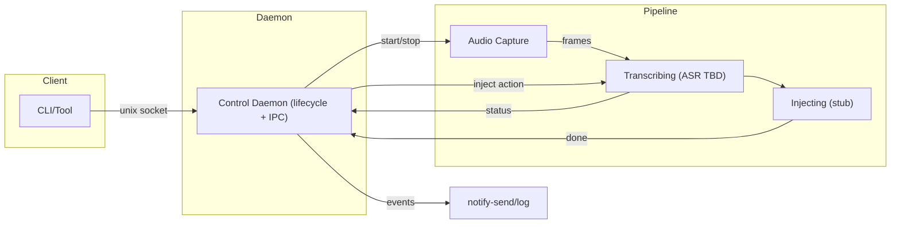
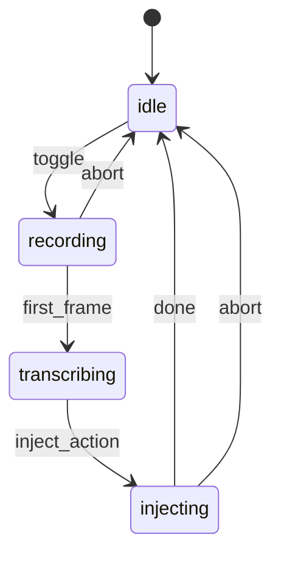

# Hyprvoice - Voice-Powered Typing for Wayland

Press a toggle key, speak, and get instant text input. A speech-to-text tool designed for Wayland/Hyprland with toggle-based workflow and seamless text injection.

## Features

- **Toggle workflow**: Press once to start recording, press again to stop and inject text
- **Wayland native**: Built specifically for modern Linux desktops (Hyprland, etc.)
- **Real-time feedback**: Desktop notifications for recording states and transcription status
- **Multiple transcription backends**: OpenAI Whisper (planned: whisper.cpp for local processing)
- **Smart text injection**: Clipboard save/restore with direct typing fallback
- **Daemon architecture**: Lightweight control plane with efficient pipeline management

**Status:** Early development - core functionality working, transcription integration in progress

## Installation

### From AUR (Arch Linux)

```bash
# Using your preferred AUR helper
yay -S hyprvoice-bin
# or
paru -S hyprvoice-bin

# Enable user service
systemctl --user enable --now hyprvoice.service
```

### Download Binary

1. Download from [GitHub Releases](https://github.com/leonardotrapani/hyprvoice/releases)
2. Install:

```bash
wget https://github.com/leonardotrapani/hyprvoice/releases/latest/download/hyprvoice-linux-x86_64
mkdir -p ~/.local/bin
mv hyprvoice-linux-x86_64 ~/.local/bin/hyprvoice
chmod +x ~/.local/bin/hyprvoice

# Add to PATH (add to ~/.bashrc or ~/.zshrc)
export PATH="$HOME/.local/bin:$PATH"
```

### Build from Source

```bash
git clone https://github.com/leonardotrapani/hyprvoice.git
cd hyprvoice

# Build the binary
CGO_ENABLED=1 go build -o hyprvoice ./cmd/hyprvoice

# Install locally
sudo cp hyprvoice /usr/local/bin/
```

## Requirements

- **Wayland desktop** (Hyprland, Niri, GNOME, KDE, etc.)
- **PipeWire audio system** with tools
- **System packages**:

```bash
# Arch Linux
sudo pacman -S pipewire pipewire-pulse pw-record wl-clipboard

# Ubuntu/Debian
sudo apt install pipewire-pulse pipewire-bin wl-clipboard

# Fedora
sudo dnf install pipewire-utils wl-clipboard
```

**For text injection (recommended):**

```bash
# Arch Linux
sudo pacman -S wtype

# Ubuntu/Debian
sudo apt install wtype

# Alternative: ydotool (if wtype unavailable)
# Follow ydotool setup for user permissions
```

**Optional:**

- `notify-send` (desktop notifications)
- `systemd --user` (daemon service)

## Quick Start

1. **Setup daemon service:**

```bash
# Enable and start the user service (reccomended)
systemctl --user enable --now hyprvoice.service

# Or run manually in background
hyprvoice serve &
```

2. **Configure Hyprland keybind:**

```bash
# Add to ~/.config/hypr/hyprland.conf
bind = SUPER, R, exec, hyprvoice toggle
```

3. **Test voice input:**

```bash
# Check daemon status
hyprvoice status

# Toggle recording (or use Super+R)
hyprvoice toggle
# Speak something...
hyprvoice toggle  # Stop and transcribe
```

## Quick Reference

### Common Commands

```bash
# Start the daemon
hyprvoice serve

# Toggle recording on/off
hyprvoice toggle

# Check current status
hyprvoice status

# Get protocol version
hyprvoice version

# Stop the daemon (if not using systemd service)
hyprvoice stop
```

### Keybinding Pattern

Most setups use this toggle pattern in window manager config:

```bash
bind = SUPER, R, exec, hyprvoice toggle
```

## Keyboard Shortcuts Setup

### Hyprland

Add to your `~/.config/hypr/hyprland.conf`:

```bash
# Hyprvoice - Voice to Text (toggle recording)
bind = SUPER, R, exec, hyprvoice toggle

# Optional: Status check
bind = SUPER SHIFT, R, exec, hyprvoice status && notify-send "Hyprvoice" "$(hyprvoice status)"
```

## Usage Examples

### Basic Toggle Workflow

1. **Press keybind** → Recording starts (notification appears)
2. **Speak your text** → Audio captured in real-time
3. **Press keybind again** → Recording stops, transcription begins
4. **Text appears** → Injected at cursor position or clipboard

### CLI Usage

```bash
# Start daemon manually (if not using systemd service)
hyprvoice serve

# In another terminal: toggle recording
hyprvoice toggle
# ... speak ...
hyprvoice toggle

# Check what's happening
hyprvoice status
```

## Configuration

Configuration will be read from `~/.config/hyprvoice/config.toml` (planned). Currently, the daemon uses default settings.

### Transcription Providers

Hyprvoice will support multiple transcription backends:

#### OpenAI Whisper API (Planned)

Fast, accurate cloud-based transcription:

```toml
[transcription]
provider = "openai"
api_key = "your_openai_api_key"
model = "whisper-1"
language = "auto"  # or "en", "es", etc.
```

#### whisper.cpp Local (Planned)

Private, offline transcription using local models:

```toml
[transcription]
provider = "whisper_cpp"
model_path = "~/models/ggml-base.en.bin"
threads = 4
```

### Service Configuration

#### Systemd Service

The daemon runs as a user service:

```bash
# Create service file
mkdir -p ~/.config/systemd/user
cat > ~/.config/systemd/user/hyprvoice.service << 'EOF'
[Unit]
Description=Hyprvoice voice-to-text daemon
After=pipewire.service

[Service]
Type=simple
ExecStart=/usr/local/bin/hyprvoice serve
Restart=on-failure
RestartSec=5

[Install]
WantedBy=default.target
EOF

# Enable and start
systemctl --user daemon-reload
systemctl --user enable --now hyprvoice.service
```

### File Locations

- **Socket**: `~/.cache/hyprvoice/control.sock` - IPC communication
- **PID file**: `~/.cache/hyprvoice/hyprvoice.pid` - Process tracking
- **Config**: `~/.config/hyprvoice/config.toml` - User settings (planned)

## Development Status

| Component             | Status | Notes                             |
| --------------------- | ------ | --------------------------------- |
| Core daemon & IPC     | ✅     | Unix socket control plane         |
| Recording workflow    | ✅     | Toggle recording via PipeWire     |
| Audio capture         | ✅     | Efficient PipeWire integration    |
| Desktop notifications | ✅     | Status feedback via notify-send   |
| OpenAI transcription  | ✅     | HTTP API integration              |
| Text injection        | ⏳     | Clipboard + typing implementation |
| Configuration system  | ⏳     | TOML-based user settings          |
| Comprehensive tests   | ⏳     | Pipeline and integration testing  |
| whisper.cpp support   | ⏳     | Local model inference             |

**Legend**: ✅ Complete · ⏳ Planned

## Architecture Overview

Hyprvoice uses a **daemon + pipeline** architecture for efficient resource management:

- **Control Daemon**: Lightweight IPC server managing lifecycle
- **Pipeline**: Stateful audio processing (recording → transcribing → injecting)
- **State Machine**: `idle → recording → transcribing → injecting → idle`

### System Architecture





### How It Works

1. **Toggle recording** → Pipeline starts, audio capture begins
2. **Audio streaming** → PipeWire frames buffered for transcription
3. **Toggle stop** → Recording ends, transcription starts
4. **Text injection** → Result typed or copied to clipboard
5. **Return to idle** → Pipeline cleaned up, ready for next session

### Data Flow

1. `toggle` (daemon) → create pipeline → recording
2. First frame arrives → transcribing (daemon may notify `Transcribing` later)
3. Audio frames → audio buffer (collect all audio during session)
4. Second `toggle` during transcribing → send `inject` action → transcribe collected audio → injecting (simulated)
5. Complete → idle; pipeline stops; daemon clears reference
6. Notifications at key transitions

## Troubleshooting

### Common Issues

#### Daemon Issues

**Daemon won't start:**

```bash
# Check if already running
hyprvoice status

# Check for stale files
ls -la ~/.cache/hyprvoice/

# Clean up and restart
rm -f ~/.cache/hyprvoice/hyprvoice.pid
rm -f ~/.cache/hyprvoice/control.sock
hyprvoice serve
```

**Command not found:**

```bash
# Check installation
which hyprvoice

# Add to PATH if using ~/.local/bin
echo 'export PATH="$HOME/.local/bin:$PATH"' >> ~/.bashrc
source ~/.bashrc
```

#### Audio Issues

**No audio recording:**

```bash
# Check PipeWire is running
systemctl --user status pipewire

# Test microphone
pw-record --help
pw-record test.wav

# Check microphone permissions and levels
```

**Audio device issues:**

```bash
# List available audio devices
pw-cli list-objects | grep -A5 -B5 Audio

# Check microphone is not muted in system settings
```

#### Notification Issues

**No desktop notifications:**

```bash
# Test notify-send directly
notify-send "Test" "This is a test notification"

# Install if missing
sudo pacman -S libnotify  # Arch
sudo apt install libnotify-bin  # Ubuntu/Debian
```

#### Text Injection Issues

**Text not appearing (when implemented):**

- Ensure cursor is in a text field when toggling off recording
- Check that `wtype` or clipboard tools are installed
- Verify window manager supports the text injection method used

### Debug Mode

```bash
# Run daemon with verbose output
hyprvoice serve

# Check logs from systemd service (or just see results from hyprvoice serve)
journalctl --user -u hyprvoice.service -f

# Test individual commands
hyprvoice toggle
hyprvoice status
```

## Development

### Building from Source

```bash
git clone https://github.com/leonardotrapani/hyprvoice.git
cd hyprvoice

# Install Go dependencies
go mod download

# Build
CGO_ENABLED=1 go build -o hyprvoice ./cmd/hyprvoice

# Run tests
go test ./...

# Install locally
sudo cp hyprvoice /usr/local/bin/
```

### Project Structure

```
hyprvoice/
├── cmd/hyprvoice/         # CLI application entry point
├── internal/
│   ├── bus/              # IPC (Unix socket) + PID management
│   ├── daemon/           # Control daemon (lifecycle management)
│   ├── notify/           # Desktop notification integration
│   ├── pipeline/         # Audio processing pipeline + state machine
│   ├── recording/        # PipeWire audio capture
│   └── transcriber/      # Transcription adapters (OpenAI, whisper.cpp)
├── go.mod                # Go module definition
└── README.md
```

### Development Workflow

```bash
# Terminal 1: Run daemon with logs
go run ./cmd/hyprvoice serve

# Terminal 2: Test commands
go run ./cmd/hyprvoice toggle
go run ./cmd/hyprvoice status
go run ./cmd/hyprvoice stop
```

### IPC Protocol

Simple single-character commands over Unix socket:

- `t` - Toggle recording on/off
- `s` - Get current status
- `v` - Get protocol version
- `q` - Quit daemon gracefully

## Contributing

Contributions welcome! Please:

- Follow existing code conventions and patterns
- Add tests for new functionality when available
- Update documentation for user-facing changes
- Test on Hyprland/Wayland before submitting PRs

## License

MIT License - see [LICENSE.md](LICENSE.md) for details.
