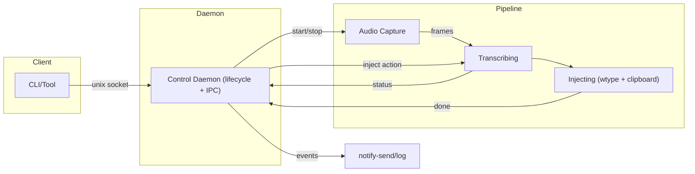
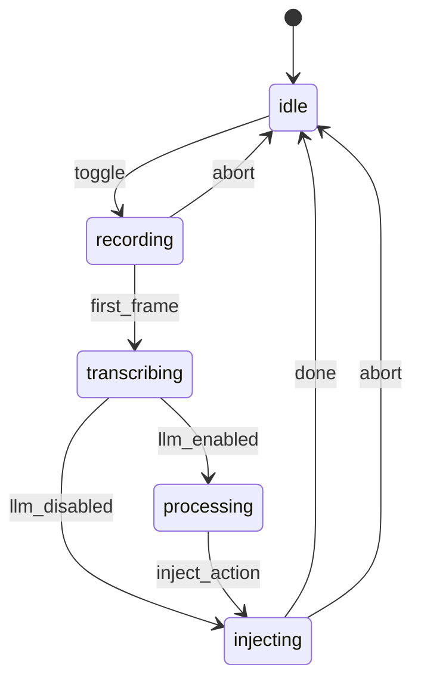

# Hyprvoice - Voice-Powered Typing for Hyprland / Wayland

Press a toggle key, speak, and get instant text input. Built natively for Wayland/Hyprland - no X11 hacks or workarounds, just clean integration with modern Linux desktops.

## Features

- **Toggle workflow**: Press once to start recording, press again to stop and inject text
- **LLM post-processing**: Automatically cleans up transcriptions - removes stutters, fixes grammar, adds punctuation (enabled by default)
- **Wayland native**: Purpose-built for Wayland compositors - no legacy X11 dependencies or hacky workarounds
- **Real-time feedback**: Desktop notifications for recording states and transcription status
- **Multiple transcription backends**: OpenAI Whisper, Groq, Mistral Voxtral, ElevenLabs Scribe, and Deepgram Nova
- **Local transcription**: Offline transcription via whisper.cpp - no API keys, no cloud, complete privacy
- **Streaming transcription**: Real-time results with ElevenLabs, Deepgram, and OpenAI Realtime
- **57 language support**: Full multilingual support with language-model compatibility validation
- **Smart text injection**: Clipboard save/restore with direct typing fallback
- **Daemon architecture**: Lightweight control plane with efficient pipeline management

**Status:** Beta - core functionality complete and tested, ready for early adopters

## Installation

### From AUR (Arch Linux) - Recommended

```bash
# Install hyprvoice and all dependencies automatically
yay -S hyprvoice-bin
# or
paru -S hyprvoice-bin
```

The AUR package automatically installs all dependencies (`pipewire`, `wl-clipboard`, `wtype`, etc.) and sets up the systemd service. Follow the post-install instructions to complete setup.

### Alternative: Download Binary

For non-Arch users or testing:

```bash
# Download and install binary
wget https://github.com/leonardotrapani/hyprvoice/releases/latest/download/hyprvoice-linux-x86_64
mkdir -p ~/.local/bin
mv hyprvoice-linux-x86_64 ~/.local/bin/hyprvoice
chmod +x ~/.local/bin/hyprvoice

# Add to PATH (add to ~/.bashrc or ~/.zshrc)
export PATH="$HOME/.local/bin:$PATH"

# You'll need to manually install dependencies and create systemd service
# See Requirements section above
```

### Build from Source

```bash
git clone https://github.com/leonardotrapani/hyprvoice.git
cd hyprvoice
go mod download
go build -o hyprvoice ./cmd/hyprvoice

# Install locally
mkdir -p ~/.local/bin
cp hyprvoice ~/.local/bin/
export PATH="$HOME/.local/bin:$PATH"
```

## Requirements

- **Wayland desktop** (Hyprland, Niri, GNOME, KDE, etc.)
- **PipeWire audio system** with tools
- **API key for transcription**: OpenAI, Groq, Mistral, ElevenLabs, or Deepgram API key (check each provider's pricing), OR whisper.cpp for local transcription (no API key required)

**System packages** (automatically installed with AUR package):

- `pipewire`, `pipewire-pulse`, `pipewire-audio` - Audio capture
- `wl-clipboard` - Clipboard integration
- `wtype` - Text typing (Wayland)
- `ydotool` - Text typing (universal, recommended for Chromium apps)
- `libnotify` - Desktop notifications
- `systemd` - User service management

For manual installation on other distros:

```bash
# Ubuntu/Debian
sudo apt install pipewire-pulse pipewire-bin wl-clipboard wtype ydotool libnotify-bin

# Fedora
sudo dnf install pipewire-utils wl-clipboard wtype ydotool libnotify

# For ydotool, you also need to start the daemon:
systemctl --user enable --now ydotool
# Or add user to input group for uinput access:
sudo usermod -aG input $USER
```

## Quick Start

After installing via AUR:

1. **Configure hyprvoice interactively:**

```bash
hyprvoice configure
```

This wizard will guide you through setting up your transcription provider, API key, audio preferences, and other settings.

2. **Enable and start the service:**

```bash
systemctl --user enable --now hyprvoice.service
```

3. **Add keybinding to your window manager:**

```bash
# For Hyprland, add to ~/.config/hypr/hyprland.conf
bind = SUPER, R, exec, hyprvoice toggle
```

4. **Test voice input:**

```bash
# Check daemon status
hyprvoice status

# Toggle recording (or use your keybind)
hyprvoice toggle
# Speak something...
hyprvoice toggle  # Stop and transcribe
```

## Quick Reference

### Common Commands

```bash
# Interactive configuration wizard
hyprvoice configure

# Start the daemon
hyprvoice serve

# Toggle recording on/off
hyprvoice toggle

# Cancel current operation
hyprvoice cancel

# Check current status
hyprvoice status

# Get protocol version
hyprvoice version

# Stop the daemon (if not using systemd service)
hyprvoice stop
```

### Model Management (Local Transcription)

```bash
# List all available models
hyprvoice model list

# List only transcription models
hyprvoice model list --type transcription

# List models for a specific provider
hyprvoice model list --provider whisper-cpp

# Download a local model
hyprvoice model download base.en

# Remove a downloaded model
hyprvoice model remove base.en
```

### Keybinding Pattern

Most setups use this toggle pattern in window manager config:

```bash
bind = SUPER, R, exec, hyprvoice toggle
bind = SUPER SHIFT, R, exec, hyprvoice cancel  # Optional: cancel current operation
```

## Keyboard Shortcuts Setup

### Hyprland

Add to your `~/.config/hypr/hyprland.conf`:

```bash
# Hyprvoice - Voice to Text (toggle recording)
bind = SUPER, R, exec, hyprvoice toggle

# Optional: Cancel current operation
bind = SUPER SHIFT, C, exec, hyprvoice cancel

# Optional: Status check
bind = SUPER SHIFT, R, exec, hyprvoice status && notify-send "Hyprvoice" "$(hyprvoice status)"
```

## Usage Examples

### Basic Toggle Workflow

1. **Press keybind** → Recording starts (notification appears)
2. **Speak your text** → Audio captured in real-time
3. **Press keybind again** → Recording stops, transcription begins
4. **Text appears** → Injected at cursor position or clipboard

**Cancel anytime:** Press your cancel keybind (e.g., `SUPER+SHIFT+C`) to abort the current operation and return to idle.

### CLI Usage

```bash
# Start daemon manually (if not using systemd service)
hyprvoice serve

# In another terminal: toggle recording
hyprvoice toggle
# ... speak ...
hyprvoice toggle

# Check what's happening
hyprvoice status
```

## Configuration

The recommended way to configure hyprvoice is through the interactive wizard:

```bash
hyprvoice configure
```

The wizard guides you through all settings with a user-friendly interface:

- **Providers** - API keys for OpenAI, Groq, Mistral, ElevenLabs, Deepgram
- **Transcription** - Speech-to-text provider and model selection (cloud or local)
- **LLM** - Post-processing to clean up transcriptions (enabled by default)
- **Keywords** - Domain-specific terms for better accuracy
- **Injection** - How text is typed (ydotool, wtype, clipboard)
- **Notifications** - Desktop notification preferences
- **Advanced Settings** - Recording parameters, timeouts

Configuration is stored in `~/.config/hyprvoice/config.toml`. Changes are applied immediately without restarting the daemon.

For manual configuration and detailed options, see [docs/config.md](docs/config.md).

## Local Transcription

For complete offline privacy, use whisper.cpp for local transcription - no API keys, no cloud, no data leaves your machine.

### Prerequisites

1. **Install whisper.cpp**: Build from source or install via package manager

   ```bash
   # Arch Linux
   yay -S whisper.cpp

   # Build from source (recommended for CUDA/Metal support)
   git clone https://github.com/ggerganov/whisper.cpp
   cd whisper.cpp && make
   sudo cp main /usr/local/bin/whisper-cli
   ```

2. **Download a model**:

   ```bash
   # List available models
   hyprvoice model list --provider whisper-cpp

   # Download recommended model (142MB, English-only, fast)
   hyprvoice model download base.en

   # Or download multilingual model (142MB, 57 languages)
   hyprvoice model download base
   ```

### Available Models

| Model      | Size  | Languages   | Speed    | Accuracy |
| ---------- | ----- | ----------- | -------- | -------- |
| tiny.en    | 75MB  | English     | Fastest  | Good     |
| base.en    | 142MB | English     | Fast     | Better   |
| small.en   | 466MB | English     | Medium   | Great    |
| medium.en  | 1.5GB | English     | Slow     | Excellent|
| tiny       | 75MB  | 57 langs    | Fastest  | Good     |
| base       | 142MB | 57 langs    | Fast     | Better   |
| small      | 466MB | 57 langs    | Medium   | Great    |
| medium     | 1.5GB | 57 langs    | Slow     | Excellent|
| large-v3   | 3GB   | 57 langs    | Slowest  | Best     |

**Recommendation**: Start with `base.en` for English or `base` for multilingual. Models ending in `.en` are English-only but slightly faster.

### Configuration

```toml
[transcription]
provider = "whisper-cpp"
model = "base.en"          # or "base" for multilingual
language = ""              # empty for auto-detect
threads = 0                # 0 = auto (NumCPU - 1)
```

## Streaming Transcription

For real-time transcription results as you speak, use streaming providers. Text appears progressively instead of waiting for the entire recording to finish.

### Streaming Providers

| Provider   | Models                     | Latency    | Languages |
| ---------- | -------------------------- | ---------- | --------- |
| ElevenLabs | scribe_v1-streaming, scribe_v2-streaming | ~150ms | 57 langs  |
| Deepgram   | nova-3, nova-2             | ~100ms     | 40+ langs |
| OpenAI     | gpt-4o-realtime-preview    | ~200ms     | 57 langs  |

### Configuration

```toml
# ElevenLabs streaming
[providers.elevenlabs]
api_key = "..."

[transcription]
provider = "elevenlabs"
model = "scribe_v2-streaming"

# Deepgram streaming
[providers.deepgram]
api_key = "..."

[transcription]
provider = "deepgram"
model = "nova-3"
```

**Note**: Streaming models show partial results while recording. Final text is accumulated and injected when you toggle off.

### Service Management

The systemd user service is automatically installed with the AUR package:

```bash
# Check service status
systemctl --user status hyprvoice.service

# Start/stop service
systemctl --user start hyprvoice.service
systemctl --user stop hyprvoice.service

# Enable/disable autostart
systemctl --user enable hyprvoice.service
systemctl --user disable hyprvoice.service

# View logs
journalctl --user -u hyprvoice.service -f
```

### File Locations

- **Socket**: `~/.cache/hyprvoice/control.sock` - IPC communication
- **PID file**: `~/.cache/hyprvoice/hyprvoice.pid` - Process tracking
- **Config**: `~/.config/hyprvoice/config.toml` - User settings
- **Models**: `~/.local/share/hyprvoice/models/whisper/` - Downloaded whisper models

## Development Status

| Component                | Status | Notes                                                 |
| ------------------------ | ------ | ----------------------------------------------------- |
| Core daemon & IPC        | ✅     | Unix socket control plane                             |
| Recording workflow       | ✅     | Toggle recording via PipeWire                         |
| Audio capture            | ✅     | Efficient PipeWire integration                        |
| Desktop notifications    | ✅     | Status feedback via notify-send                       |
| OpenAI transcription     | ✅     | HTTP API + Realtime streaming                         |
| Groq transcription       | ✅     | Fast Whisper API with transcription and translation   |
| Mistral transcription    | ✅     | Voxtral API for European languages                    |
| ElevenLabs transcription | ✅     | Scribe batch + streaming (90+ languages)              |
| Deepgram transcription   | ✅     | Nova-3 streaming (40+ languages)                      |
| Local transcription      | ✅     | whisper.cpp with model download management            |
| Streaming support        | ✅     | Real-time results with ElevenLabs, Deepgram, OpenAI   |
| Model management         | ✅     | `hyprvoice model list/download/remove` CLI            |
| Language validation      | ✅     | Model-language compatibility checking                 |
| LLM post-processing      | ✅     | OpenAI/Groq text cleanup (enabled by default)         |
| Text injection           | ✅     | Clipboard + wtype/ydotool with fallback               |
| Configuration system     | ✅     | TOML-based user settings with hot-reload              |
| Interactive TUI setup    | ✅     | `hyprvoice configure` wizard with section editing     |
| Unit test coverage       | ✅     | Comprehensive test suite (100% pass)                  |
| CI/CD Pipeline           | ✅     | Automated builds and releases via GitHub Actions      |
| Installation (AUR etc)   | ✅     | AUR package with automated dependency installation    |

**Legend**: ✅ Complete · ⏳ Planned

## Architecture Overview

Hyprvoice uses a **daemon + pipeline** architecture for efficient resource management:

- **Control Daemon**: Lightweight IPC server managing lifecycle
- **Pipeline**: Stateful audio processing (recording → transcribing → processing → injecting)
- **State Machine**: `idle → recording → transcribing → processing → injecting → idle`

### System Architecture





### How It Works

1. **Toggle recording** → Pipeline starts, audio capture begins
2. **Audio streaming** → PipeWire frames buffered for transcription
3. **Toggle stop** → Recording ends, transcription starts
4. **LLM processing** → Text cleaned up (if enabled, which is the default)
5. **Text injection** → Result typed or copied to clipboard
6. **Return to idle** → Pipeline cleaned up, ready for next session

### Data Flow

1. `toggle` (daemon) → create pipeline → recording
2. First frame arrives → transcribing (daemon may notify `Transcribing` later)
3. Audio frames → audio buffer (collect all audio during session)
4. Second `toggle` during transcribing → transcribe collected audio
5. If LLM enabled → processing → clean up text with LLM
6. injecting → type or paste text
7. Complete → idle; pipeline stops; daemon clears reference
8. Notifications at key transitions

## Troubleshooting

### Common Issues

#### Daemon Issues

**Daemon won't start:**

```bash
# Check if already running
hyprvoice status

# Check for stale files
ls -la ~/.cache/hyprvoice/

# Clean up and restart
rm -f ~/.cache/hyprvoice/hyprvoice.pid
rm -f ~/.cache/hyprvoice/control.sock
hyprvoice serve
```

**Command not found:**

```bash
# Check installation
which hyprvoice

# Add to PATH if using ~/.local/bin
echo 'export PATH="$HOME/.local/bin:$PATH"' >> ~/.bashrc
source ~/.bashrc
```

#### Audio Issues

**No audio recording:**

```bash
# Check PipeWire is running
systemctl --user status pipewire

# Test microphone
pw-record --help
pw-record test.wav

# Check microphone permissions and levels
```

**Audio device issues:**

```bash
# List available audio devices
pw-cli list-objects | grep -A5 -B5 Audio

# Check microphone is not muted in system settings
```

#### Notification Issues

**No desktop notifications:**

```bash
# Test notify-send directly
notify-send "Test" "This is a test notification"

# Install if missing
sudo pacman -S libnotify  # Arch
sudo apt install libnotify-bin  # Ubuntu/Debian
```

#### Text Injection Issues

**Text not appearing:**

- Ensure cursor is in a text field when toggling off recording
- Check that `wtype` and `wl-clipboard` tools are installed:

  ```bash
  # Test wtype directly
  wtype "test text"

  # Test clipboard tools
  echo "test" | wl-copy
  wl-paste
  ```

- Verify Wayland compositor supports text input protocols
- Check injection mode in configuration (fallback mode is most robust)

**Clipboard issues:**

```bash
# Install wl-clipboard if missing
sudo pacman -S wl-clipboard  # Arch
sudo apt install wl-clipboard  # Ubuntu/Debian

# Test clipboard functionality
wl-copy "test text"
wl-paste
```

### Debug Mode

```bash
# Run daemon with verbose output
hyprvoice serve

# Check logs from systemd service (or just see results from hyprvoice serve)
journalctl --user -u hyprvoice.service -f

# Test individual commands
hyprvoice toggle
hyprvoice status
```

## Development

### Building from Source

```bash
git clone https://github.com/leonardotrapani/hyprvoice.git
cd hyprvoice
go mod download
go build -o hyprvoice ./cmd/hyprvoice

# Install locally
mkdir -p ~/.local/bin
cp hyprvoice ~/.local/bin/
export PATH="$HOME/.local/bin:$PATH"
```

## For Maintainers

### Publishing to AUR

See [`packaging/RELEASE.md`](packaging/RELEASE.md) for complete release process including AUR deployment.

Quick start for AUR:

```bash
# After creating your first GitHub release
cd packaging/
./setup-aur.sh    # One-time AUR repository setup
```

### Project Structure

```
hyprvoice/
├── cmd/hyprvoice/         # CLI application entry point
├── internal/
│   ├── bus/              # IPC (Unix socket) + PID management
│   ├── config/           # Configuration loading and validation
│   ├── daemon/           # Control daemon (lifecycle management)
│   ├── deps/             # Dependency checking (whisper-cli, ffmpeg)
│   ├── injection/        # Text injection (clipboard + wtype + ydotool)
│   ├── language/         # Language codes and provider-specific mappings
│   ├── llm/              # LLM post-processing adapters (OpenAI, Groq)
│   ├── models/whisper/   # Whisper model info and download management
│   ├── notify/           # Desktop notification integration
│   ├── pipeline/         # Audio processing pipeline + state machine
│   ├── provider/         # Provider registry with Model metadata
│   ├── recording/        # PipeWire audio capture
│   ├── transcriber/      # Batch and streaming adapters (OpenAI, Groq, Mistral, ElevenLabs, Deepgram, whisper-cpp)
│   └── tui/              # Interactive configuration wizard
├── go.mod                # Go module definition
└── README.md
```

### Development Workflow

```bash
# Terminal 1: Run daemon with logs
go run ./cmd/hyprvoice serve

# Terminal 2: Test commands
go run ./cmd/hyprvoice toggle
go run ./cmd/hyprvoice status
go run ./cmd/hyprvoice stop
```

### IPC Protocol

Simple single-character commands over Unix socket:

- `t` - Toggle recording on/off
- `c` - Cancel current operation
- `s` - Get current status
- `v` - Get protocol version
- `q` - Quit daemon gracefully

## Contributing

Contributions welcome! Please:

- Follow existing code conventions and patterns
- Add tests for new functionality when available
- Update documentation for user-facing changes
- Test on Hyprland/Wayland before submitting PRs

## License

MIT License - see [LICENSE.md](LICENSE.md) for details.
